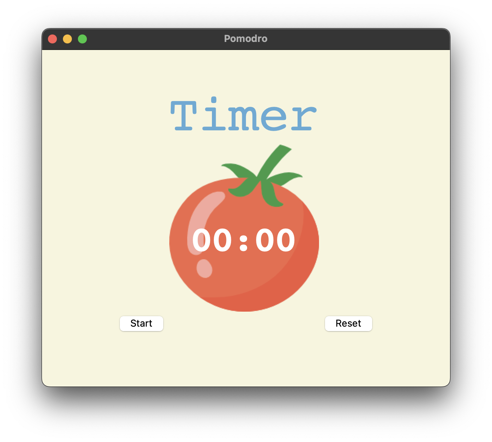
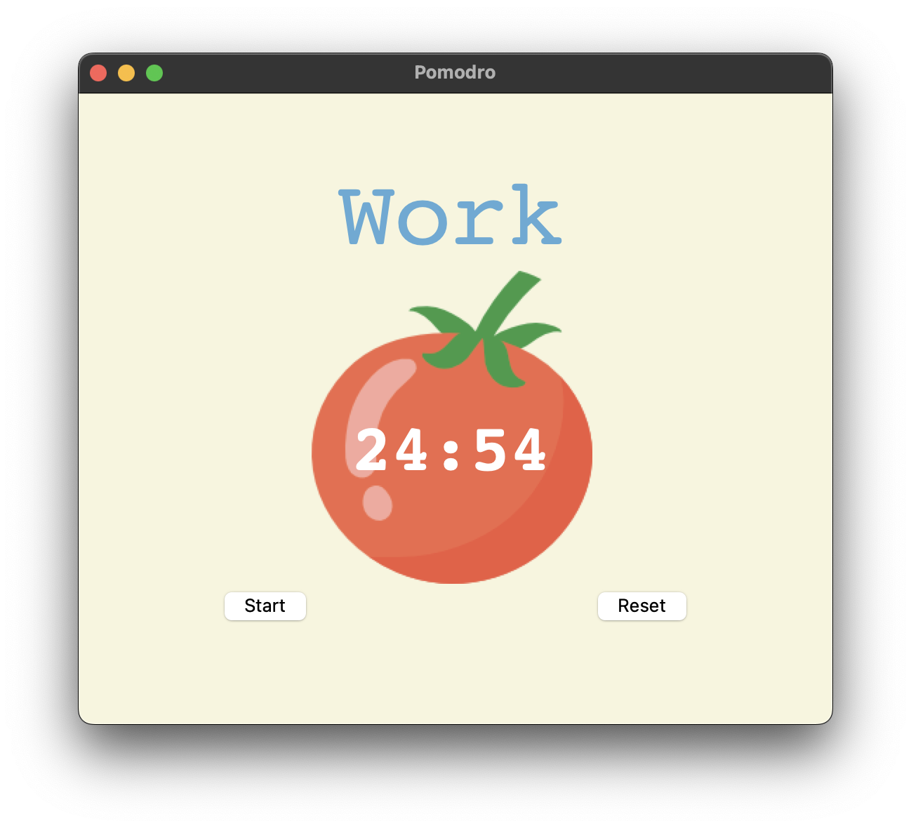

# Pomodoro Application 🕒

A lightweight **Pomodoro timer** built in Python to help manage focused work and rest intervals with minimal distraction.

---

## 📝 Description

This application implements the classic Pomodoro Technique:

- Work intervals (25 min)  
- Short breaks (5 min)  
- After a four cycles, a longer break  
- Visual countdown display, start/pause/reset buttons  

It’s built for simplicity and ease of use, so you can focus on work rather than managing tools.

---

## 🛠 Features

- Start / Pause / Reset the timer  
- Custom durations for work, short break & long break  
- Automatic cycle transitions  
- Visual countdown display  

---

## 🚀 Getting Started

### Prerequisites

- Python 3.x  

### Installation / Usage

   ```bash
   git clone https://github.com/dharsan19/pomodro-application.git
   cd pomodro-application
   python main.py
   ```

---   

## 📷 Screenshots

  

  

